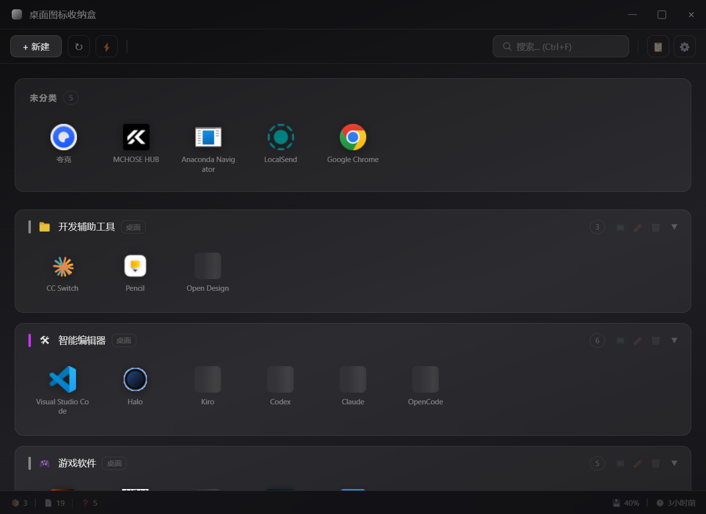
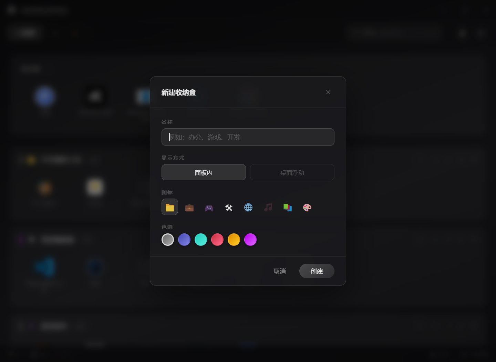
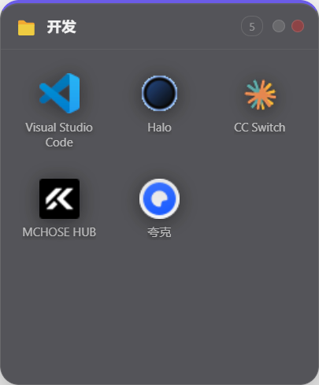
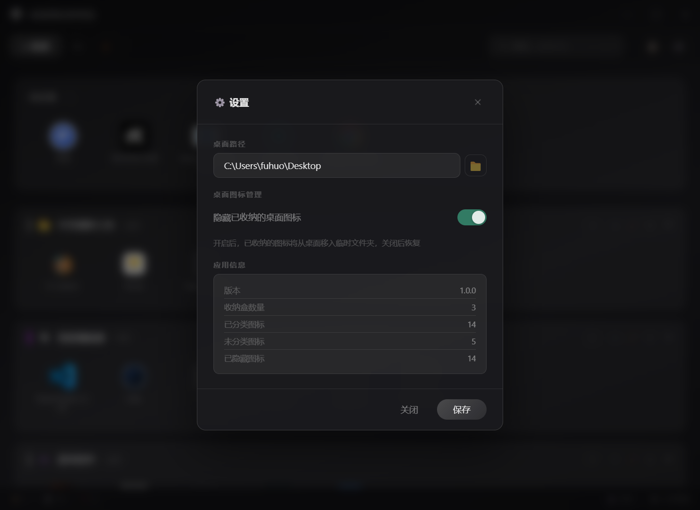

<p align="center">
  
</p>

<h1 align="center">桌面图标收纳盒</h1>

<p align="center">
  <strong>Windows 桌面快捷方式收纳管理工具</strong><br>
  分类整理、高效管理、一键直达你的桌面快捷方式
</p>

<p align="center">
  <a href="README.md">🇺🇸 English Documentation</a>
</p>

<p align="center">
  
  
  
  
</p>

---

一款基于 **Electron** 构建的 Windows 桌面应用，让你将桌面快捷方式（`.lnk` / `.url`）整理到自定义「收纳盒」中——支持桌面浮动窗口、快速整理、图标缓存、毛玻璃暗色主题 UI。

## 界面截图

### 主窗口

核心管理界面——创建收纳盒、拖拽快捷方式、一键快速整理。

<p align="center">
  
</p>

### 新建收纳盒

为收纳盒命名，选择图标、色调和显示方式（面板内 / 桌面浮动）。

<p align="center">
  
</p>

### 桌面浮动窗口

将任意收纳盒固定在桌面上，以透明、置顶的浮动小组件形式随时访问。

<p align="center">
  
</p>

### 首次启动

首次运行时，设置面板帮助你配置桌面路径和显示偏好。

<p align="center">
  
</p>

## 功能特性

| 功能 | 说明 |
|------|------|
| **快捷方式扫描** | 自动扫描用户桌面和公共桌面文件夹中的 `.lnk` 和 `.url` 文件 |
| **智能分类** | 创建命名收纳盒，拖拽快捷方式在盒子间自由移动 |
| **桌面浮动窗口** | 将任意收纳盒显示为透明、无边框、置顶的桌面小组件 |
| **快速整理** | 基于收纳盒名称关键词自动归类未分类的快捷方式 |
| **图标提取** | 通过 PowerShell 从 `.exe`、`.dll`、`.ico` 提取程序图标，支持多级缓存 |
| **活动日志** | 记录所有用户操作（移动、创建、删除、重命名），带时间戳 |
| **系统托盘** | 关闭窗口时最小化到托盘，托盘菜单支持一键整理 |
| **状态栏** | 实时显示磁盘使用率、内存使用率、收纳盒/项目数量统计 |
| **键盘快捷键** | `Ctrl+F` 搜索、`Ctrl+N` 新建收纳盒、`Ctrl+R` 刷新、`Ctrl+Shift+O` 快速整理 |

## 环境要求

- **Node.js** >= 18.0.0
- **pnpm** >= 8.0.0（推荐，项目使用 pnpm 作为包管理器）
- **Windows** 10/11（依赖 PowerShell 和 Windows Shell COM 组件）

## 快速开始

### 安装 pnpm

```bash
npm install -g pnpm
```

### 安装依赖

```bash
pnpm install
```

### 开发运行

```bash
pnpm start
```

### 构建安装包

```bash
pnpm run build
```

输出位置：`dist/桌面图标收纳盒 Setup x.x.x.exe`

### 打包调试版本

```bash
pnpm run pack
```

输出位置：`dist/win-unpacked/`（免安装便携版）

## 项目结构

```
desktop-organizer/
├── src/
│   ├── main.js                  # Electron 主进程（约 1059 行）
│   │   ├── 配置管理              #   loadConfig / saveConfig → %APPDATA%
│   │   ├── 快捷方式扫描          #   readDesktopShortcuts / parseLnkFile
│   │   ├── 图标提取              #   extractIconBase64 / 并发提取（4 workers）
│   │   ├── 桌面浮动窗口          #   createDesktopBox / desktopBoxes Map
│   │   ├── 系统托盘              #   Tray / buildTrayMenu
│   │   └── IPC 处理器            #   20+ 个 ipcMain.handle() 通道
│   │
│   ├── preload.js               # 主窗口预加载脚本（通过 contextBridge 桥接 IPC）
│   ├── utils.js                 # 共享工具函数（escapeHtml、formatBytes 等）
│   │
│   ├── renderer/                # 主管理窗口
│   │   ├── index.html           #   毛玻璃风格界面布局
│   │   ├── app.js               #   窗口逻辑、拖拽、弹窗（约 1008 行）
│   │   └── styles.css           #   暗色主题 + backdrop-filter 模糊（约 913 行）
│   │
│   ├── desktop-box/             # 桌面浮动窗口
│   │   ├── index.html           #   窗口布局
│   │   ├── preload.js           #   窗口 IPC 桥接
│   │   ├── app.js               #   窗口逻辑（约 231 行）
│   │   └── style.css            #   窗口样式（约 229 行）
│   │
│   └── ps/                      # PowerShell 脚本（仅 Windows）
│       ├── parse-lnk.ps1        #   通过 WScript.Shell COM 解析 .lnk
│       └── extract-icon.ps1     #   通过 System.Drawing 提取图标
│
├── scripts/
│   └── start.js                 # 开发启动脚本（以子进程方式启动 Electron）
├── assets/
│   └── icon.ico                 # 应用图标
├── screenshots/                 # 应用截图
├── package.json
└── pnpm-lock.yaml
```

## 系统架构

```
┌──────────────────────────────────────────────────────────────┐
│                     Electron 主进程                          │
│  ┌──────────────┐  ┌──────────────────┐  ┌────────────────┐  │
│  │  快捷方式     │→│   PowerShell     │→│  配置管理       │  │
│  │  扫描与解析   │  │   图标提取       │  │  config.json   │  │
│  └──────────────┘  └──────────────────┘  └────────────────┘  │
│       ↕ IPC               ↕ IPC               ↕ IPC          │
├──────────────────────────────────────────────────────────────┤
│                     渲染进程                                  │
│  ┌───────────────────────┐      ┌─────────────────────────┐  │
│  │    主管理窗口          │      │  桌面浮动窗口（N 个）    │  │
│  │  ┌─────────────────┐  │      │  ┌───────────────────┐  │  │
│  │  │  收纳盒列表      │  │      │  │  单个收纳盒        │  │  │
│  │  │  未分类区域      │  │      │  │  拖拽排序          │  │  │
│  │  │  状态栏         │  │      │  │  折叠/展开         │  │  │
│  │  └─────────────────┘  │      │  └───────────────────┘  │  │
│  └───────────────────────┘      └─────────────────────────┘  │
└──────────────────────────────────────────────────────────────┘
```

## 配置说明

应用数据存储在 `%APPDATA%/desktop-organizer/` 目录下：

| 路径 | 说明 |
|------|------|
| `data/config.json` | 收纳盒配置（盒子列表、未分类项） |
| `data/activity-log.json` | 活动日志（最多 200 条） |
| `icons/` | 图标缓存目录（MD5 命名，带修改时间校验） |
| `app.log` | 应用运行日志 |

### config.json 结构

```json
{
  "boxes": [
    {
      "id": "box_xxx",
      "name": "开发工具",
      "items": [
        {
          "name": "VS Code",
          "path": "C:\\Users\\...\\Visual Studio Code.lnk",
          "type": "lnk",
          "iconPath": "C:\\...\\Code.exe",
          "iconData": "base64..."
        }
      ],
      "onDesktop": false,
      "collapsed": false,
      "desktopPos": { "x": 100, "y": 100 },
      "desktopSize": { "width": 260, "height": 320 }
    }
  ],
  "unassigned": [],
  "lastOrganizeTime": 1717500000000
}
```

## IPC 通道参考

| 通道名称 | 方向 | 说明 |
|----------|------|------|
| `get-shortcuts` | 渲染 → 主进程 | 获取桌面快捷方式列表 |
| `load-config` | 渲染 → 主进程 | 加载收纳盒配置 |
| `save-config` | 渲染 → 主进程 | 保存收纳盒配置 |
| `open-shortcut` | 渲染 → 主进程 | 打开快捷方式 |
| `create-desktop-box` | 渲染 → 主进程 | 创建桌面浮动窗口 |
| `close-desktop-box` | 渲染 → 主进程 | 关闭桌面浮动窗口 |
| `quick-organize` | 渲染 → 主进程 | 执行快速整理 |
| `box-updated` | 主进程 → 渲染 | 收纳盒数据变更通知 |
| `icon-updated` | 主进程 → 渲染 | 图标加载完成通知 |
| `activity-updated` | 主进程 → 渲染 | 活动日志更新通知 |

## 故障排查

### 应用无法启动

1. 检查 Node.js 版本：`node --version`
2. 重新安装依赖：`pnpm install`
3. 查看日志文件：`%APPDATA%/desktop-organizer/app.log`

### 图标不显示

- 图标提取依赖 PowerShell，确保未被组策略禁用
- 清除图标缓存：删除 `%APPDATA%/desktop-organizer/icons/` 目录
- 检查目标程序路径是否有效

### 桌面浮动窗口异常

- 窗口位置保存在 `config.json` 的 `desktopPos` 字段
- 重置位置：编辑配置文件删除 `desktopPos` 和 `desktopSize` 字段
- 关闭浮动窗口不会丢失收纳盒数据，可通过主窗口重新打开

### 快速整理不生效

- 快速整理基于收纳盒名称与快捷方式名称的关键词匹配（不区分大小写）
- 确保收纳盒名称包含有意义的关键词（如"开发"、"游戏"、"办公"）
- 仅对「未分类」区域的快捷方式生效

## 技术栈

| 组件 | 技术方案 |
|------|---------|
| 应用框架 | Electron 28.3.3 |
| 构建工具 | electron-builder 24.9.0 |
| 包管理器 | pnpm |
| 运行时依赖 | fs-extra 11.2.0 |
| UI 实现 | 原生 HTML/CSS/JS，毛玻璃暗色主题 |
| Windows 集成 | PowerShell、WScript.Shell COM、System.Drawing |

## 开源协议

[MIT](LICENSE)
